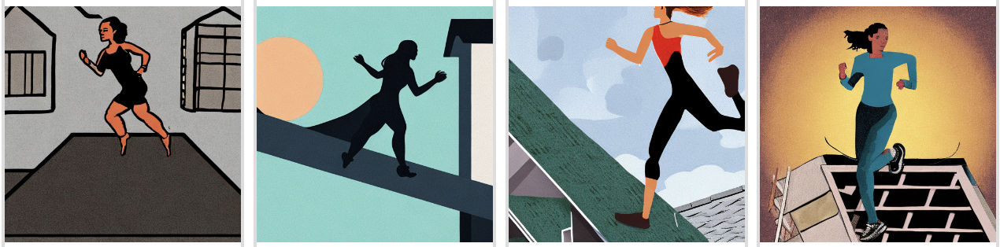
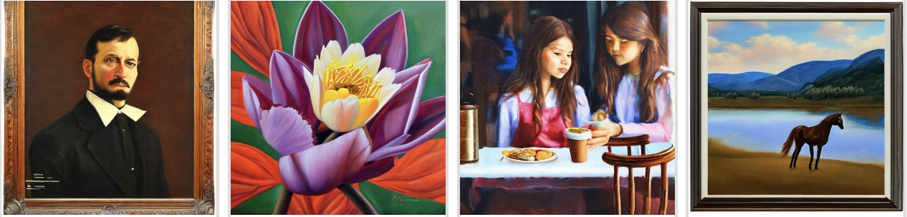

# 🐣 Runhouse Basics - Fun with Stable Diffusion and FLAN-T5

Runhouse is nothing more than an accessibility and sharing
layer into your own cloud compute and data resources. This tutorial 
demonstrates an easy and inexpensive way to quickly get started with
running Stable Diffusion.

## Table of Contents
- [Hardware Setup](#hardware-setup)] 
- [Stable Diffusion on a Cloud GPU in 5 lines of code](#01-stable-diffusion-on-a-cloud-gpu-in-5-lines-of-code)
- [Fast Stable Diffusion with Model Pinning](#02-fast-stable-diffusion-with-model-pinning)
- [FLAN-T5 Stable Diffusion](#03-flan-t5-stable-diffusion)
- [Appendix](#appendix)
    - [Running in Colab](#running-in-colab)


## 00: Hardware Setup
These tutorials are designed to use an Ampere-based GPU such as an A100. If you have
GCP, Azure, or Lambda Labs enabled (run `sky check` to see if you do), you can proceed as-is. 
If you have AWS credentials, you'll need to use an A10G as AWS doesn't have single 
A100s available. To do this, all you need to do is run the following in a python interpreter 
once (just once ever, not once per tutorial) before running the tutorials:
```python
rh.cluster(name='rh-a10x', instance_type='g5.2xlarge', provider='aws').save()
```
To bring your own GPU (e.g. if you have a Paperspace or Coreweave account), you can run:
```python
rh.cluster(ips=['<ip of the cluster>'], 
           ssh_creds={'ssh_user': '...', 'ssh_private_key':'<path_to_key>'},
           name='rh-a10x').save()
```
And if you ran either of the above and would like to switch back to the original A100 for GCP, Azure, or Lambda:
```python
# For GCP, Azure, or Lambda Labs
rh.cluster(name='rh-a10x', instance_type='A100:1').save()
```
If you'd like to run these tutorials on a different kind of GPU, make sure to change the torch version appropriately
in the `requirements.txt` file of this repo (e.g. for a V100, remove the 
"--extra-index-url https://download.pytorch.org/whl/cu117" line). In many tutorials, those requirements will be 
installed on your cluster when you setup a send.

## 01 Stable Diffusion on a Cloud GPU in 5 lines of code

Running Stable Diffusion from your laptop is hard, and waiting for queues or 
free-tier hardware can be a drag. We'll use Runhouse to experiment with Stable 
Diffusion from your laptop, while the model actually runs on an A100/A10G
in the cloud. 

> **Note**:
It can take a few minutes to run this tutorial the first time, while we wait
for the GPU to allocate and for the Stable Diffusion model to download.
Future runs should be faster, as the GPU is reused throughout most of these
tutorials. 

To run this tutorial from your laptop:
```commandline
python p01_sd_generate.py
```

First, we instantiate a cluster called `rh-a10x`, based on your cloud credentials. 

```python
# For GCP, Azure, or Lambda Labs
gpu = rh.cluster(name='rh-a10x', instance_type='A100:1').save()

# For AWS (single A100s not available, base A10G may have insufficient CPU RAM)
gpu = rh.cluster(name='rh-a10x', instance_type='g5.2xlarge', provider='aws').save()

# To use our own GPU (or from a different provider, e.g. Paperspace, Coreweave)
gpu = rh.cluster(ips=['<cluster ip>'], 
                 ssh_creds={'ssh_user': '...', 'ssh_private_key':'<path_to_key>'},
                 name='rh-a10x').save()
```

Next, we define the function that we would like to be able to run on the
cluster. In this case, the function downloads a Stable Diffusion model and
feeds the prompt to the model, returning the generated images.

```python
def sd_generate(prompt, num_images=1, steps=100, guidance_scale=7.5, model_id='stabilityai/stable-diffusion-2-base'):
    pipe = StableDiffusionPipeline.from_pretrained(model_id, torch_dtype=torch.float16, revision='fp16').to('cuda')
    return pipe([prompt] * num_images, num_inference_steps=steps, guidance_scale=guidance_scale).images
```

To run the function, we create a Python callable using `rh.send`, which stands
for **s**erverless **end**point, and pass in the corresponding hardware, or
cluster, that we want it to be run on, along with any dependencies or
requirements to install or sync over to the remote cluster. This callable
functions just like our original function; we can call it and get back results
locally, except the computation happens on the specified cluster hardware.

> **Note**:
The first time this function is called, it will need to download the model onto the cluster, which can take a minute.

> **Note**:
The inputs and outputs to this callable must be serializable with cloudpickle
and <2GB. This limit is subject to change if needed.

```python
# This function runs the `sd_generate` function on `gpu` cluster
# Setting reqs=['./'] will sync over this git repo and install its dependencies
# If the cluster is not up yet, this step will also spin up the cluster
generate_gpu = rh.send(fn=sd_generate, hardware=gpu, reqs=['./'])

rh_prompt = 'A digital illustration of a woman running on the roof of a house.'
images = generate_gpu(rh_prompt, num_images=4, steps=50)
[image.show() for image in images]
```



Runhouse allows you to save and reuse functions, to make your work accessible
from anywhere. As we'll reuse this function in the next tutorial, let's save
and name it `sd_generate`. If you've created an account and logged in, it will
be saved to our store. If not, it will be saved locally to the `rh/` directory
of this git repo.

```python
generate_gpu.save(name='sd_generate')
```

By default, the GPU will terminate after 30 minutes, but let's keep it up to reuse it in the following tutorials.

```python
gpu.keep_warm()

# To stop the cluster after 10 min of inactivity
# gpu.keep_warm(autostop_mins=10)

# To terminate the cluster through runhouse. It can also be terminated directly through the cloud provider
# or by using the CLI commands `sky down gpu` or `sky down --all`
# gpu.teardown()  
```

## 02 Fast Stable Diffusion with Model Pinning

In this tutorial, we bring down the time to run Stable Diffusion to ~1.5s/image
 (without complation) by pinning the model to GPU memory using Runhouse.

To run this tutorial from your laptop:
```commandline
python p02_faster_sd_generate.py
```

> **Note**:
The first time this is run, the model is not yet in memory, so you will not
observe the speedup. It is pinned to memory in this run, so future runs will
be faster.

Here, we use  `rh.pin_to_memory` and `rh.get_pinned_object(model_id)` to pin or
retrieve a Stable Diffusion model from GPU memory. The following function will
reuse a Stable Diffusion model that has been pinned to GPU memory to generate the
images, or it will download and pin it to memory if it does not yet exist.

```python
def sd_generate_pinned(prompt, num_images=1, steps=100, guidance_scale=7.5,
                       model_id='stabilityai/stable-diffusion-2-base',
                       dtype=torch.float16, revision="fp16"):
    pipe = rh.get_pinned_object(model_id)

    # pin to memory if it is not in memory yet
    if pipe is None:
        pipe = StableDiffusionPipeline.from_pretrained(model_id, torch_dtype=dtype, revision=revision).to("cuda")
        pipe.scheduler = DDIMScheduler.from_config(pipe.scheduler.config)
        rh.pin_to_memory(model_id, pipe)
    
    return pipe(prompt, num_images_per_prompt=num_images,
                num_inference_steps=steps, guidance_scale=guidance_scale).images
```

Similar to the above tutorial, we instantiate our cluster, send the function to
be run on the cluster, and retrieve the generated images locally. Recall that the first run will download and pin the Stable Diffusion model, and following
runs reuse the model, making them much faster.

```python
# For GCP and Azure
gpu = rh.cluster(name='rh-a10x', instance_type='A100:1')
# For AWS
# gpu = rh.cluster(name='rh-a10x', instance_type='g5.2xlarge', provider='aws')

generate_gpu = rh.send(fn=sd_generate_pinned, hardware=gpu, name='sd_generate').save()
my_prompt = 'A hot dog made of matcha powder.'
images = generate_gpu(my_prompt, num_images=4, steps=50)
[image.show() for image in images]
```


## 03 FLAN-T5 Stable Diffusion

Generating prompts is tiring, so let's use FLAN-T5, a text-to-text generation
model, to do it for us. We'll send a FLAN-T5 inference function to our GPU, and
then pipe the outputs into our Stable Diffusion service. In this process, we
also show how one can go about reusing a cluster and pipelining sends.

To run this tutorial from your laptop:
```commandline
python p03_flan_t5_xl_generate.py
```

The following function generates a prompt from an initial prompt using the
FLAN-T5 model, and performs model pinning according to the tutorial above.

```python
def causal_lm_generate(prompt, model_id='google/flan-t5-xl', **model_kwargs):
    (tokenizer, model) = rh.get_pinned_object(model_id) or (None, None)
    if model is None:
        tokenizer = AutoTokenizer.from_pretrained(model_id)
        model = AutoModelForSeq2SeqLM.from_pretrained(model_id).to('cuda')
        rh.pin_to_memory(model_id, (tokenizer, model))
    inputs = tokenizer(prompt, return_tensors="pt").to('cuda')
    outputs = model.generate(**inputs, **model_kwargs)
    return tokenizer.batch_depython(outputs, skip_special_tokens=True)
```

We set up our Runhouse cluster, and use the function above to generate prompts,
 which we will later feed into our Stable Diffusion function that we created in
tutorial 01. Note that the first time this runs, it will take ~7 min to
download the model. Future runs using the pinned model should take ~4 secs.

```python
gpu = rh.cluster(name='rh-a10x', instance_type='A100:1') # GCP and Azure
# gpu = rh.cluster(name='rh-a10x', instance_type='g5.2xlarge', provider='aws')  # On AWS

flan_t5_generate = rh.send(fn=causal_lm_generate,
                            hardware=gpu,
                            reqs=['local:./'],
                            name='flan_t5_generate')

my_prompt = "A detailed oil painting of"
sequences = flan_t5_generate(my_prompt, max_new_tokens=100, min_length=20, temperature=2.0, repetition_penalty=3.0,
                                use_cache=False, do_sample=True, num_beams=3, num_return_sequences=4)
                                
sequences = [f"{my_prompt} {seq}" for seq in sequences]
for seq in sequences:
    print(seq)
```

Ouptut:
```
A detailed oil painting of a portrait of artist on the cover of Art magazine in 1892. Oil on canvas 24"x 30". Signed lower right.
A detailed oil painting of tulips and other flowers that bloom in late summer or early fall, on a green background. 
A detailed oil paint of an autumn leaf petal with a lotus flower floating on it.
A detailed oil painting of a young woman and her two girls sitting near the window of a restaurant during their last lunch together, drinking coffee from a saucer.
A detailed oil painting of a horse standing next to a lake with grassy hillside in blue sky. There is an autumnal-toned brown background, but this piece could be put on any wall of a room and looks equally at home in the living room as well as bedroom.
```

We can reload the function we created in the previous tutorial because we named it and called save().
If you logged into Runhouse, it was saved on our Resource Naming Server. If you didn't, it saved in
the rh/ directory of the top-level git directory.

```python
generate_gpu = rh.send(name='sd_generate')
images = generate_gpu(sequences, num_images=1, steps=50)
[image.show() for image in images]
```


# Appendix

## Running in Colab

If you prefer to read or run this tutorial in Colab, you can do so 
[here](https://colab.research.google.com/github/run-house/tutorials/blob/main/t01_Stable_Diffusion/x01_Colab_Stable_Diffusion.ipynb).
Note that this notebook still sends the models to GPUs in your cloud account and not
the Colab GPUs (though you're still free to use them as you normally would). 