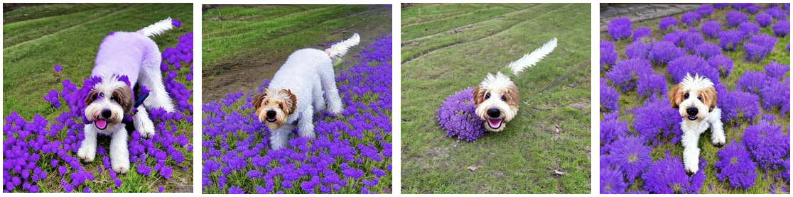

# 🧑‍🎨 Fancy Runhouse - Dreambooth in <10 Minutes

We want Runhouse to be aggressively zero-lift. Whatever code
structure, whatever execution environment (notebook, 
orchestrator, data app, CI/CD), you should be able to do something fun
and interesting with Runhouse in minutes, not months. This tutorial
shows how you can easily import and reuse GitHub code using Runhouse.
In just a few lines of code, we can fine-tune Stable Diffusion using
Dreambooth, perform inference, and even integrate a Gradio app.

## Table of Contents
- [Dreambooth Fine-Tuning and Inference](#01-dreambooth-fine-tuning-and-inference)
- [CLIP Interrogator: Running Hugging Face Spaces](#02-clip-interrogator)
- [Appendix](#appendix)
    - [Dreambooth in Colab](#dreambooth-in-colab)

## 01 Dreambooth Fine-Tuning and Inference

Dreambooth is a popular app that lets you fine-tune Stable Diffusion on your
own images so you can personalize your Stable Diffusion inferences.
Hugging Face published a [great tutorial](https://huggingface.co/blog/dreambooth),
but it's never easy to set up on your own hardware, so various Colabs are circulating
to help people get started. We can run way faster on our own GPU, and we don't even 
need to clone down the repo! This tutorial shows how to send a function to your 
hardware from just a GitHub URL pointing to the function.

It also shows you basics of the data side of Runhouse, by:
1) Creating an `rh.folder` with the training images and then sending it to the
cluster using `folder.to(my_gpu)`. 
2) Similarly, sending the folder containing the trained model to blob storage.

This is the tip of the iceberg, and there's much more about data on the way, so
let's get started!

We present a rough walk through of the code below.
To run the full tutorial, please run locally from your laptop:
```commandline
python p01_dreambooth_train.py
python p01a_dreambooth_predict.py
```

Let's instantiate a cluster and send our local folder of training images to the
cluster. We create an `rh.folder` object that we move to the cluster, using
`folder.to(gpu)`.

We have provided some sample photos of Poppy, the company dog, in our assets folder,
or feel free to upload your own images to the folder to personalize the experience!

```python
gpu = rh.cluster(name='rh-a10x')

input_images_dir = 'assets/t02/images'
remote_image_dir = 'dreambooth/instance_images'
rh.folder(url=input_images_dir).to(fs=gpu, url=remote_image_dir)
```

Next we create a Runhouse function to train dreambooth.
We want to reuse the `main` function in 
[Hugging Face's Dreambooth training script](https://github.com/huggingface/diffusers/blob/main/examples/dreambooth/train_dreambooth.py),
which we can accomplish by directly using passing the GitHub URL and function
name to `fn`.

```python
training_function_gpu = rh.send(
    fn='https://github.com/huggingface/diffusers/blob/main/examples/dreambooth/train_dreambooth.py:main',
    hardware=gpu,
    reqs=['datasets', 'accelerate', 'transformers', 'diffusers==0.10.0',
        'torch --upgrade --extra-index-url https://download.pytorch.org/whl/cu117',
        'torchvision --upgrade --extra-index-url https://download.pytorch.org/whl/cu117'
        ],
    name='train_dreambooth')
```

Similarly, for creating training args using the `parse_args` function from the
same GitHub file:
```python
create_train_args = rh.send(
    fn='https://github.com/huggingface/diffusers/blob/main/examples/dreambooth/train_dreambooth.py:parse_args',
    hardware=gpu,
    reqs=[]
)
train_args = create_train_args(
    input_args=['--pretrained_model_name_or_path', 'stabilityai/stable-diffusion-2-base',
                '--instance_data_dir', remote_image_dir,
                '--instance_prompt', f'a photo of sks dog']
    )
```

Now that we have all the pieces, we can put them together as follows to train
our Dreambooth model.

```python
training_function_gpu(train_args)
```

Once the model is done training, we can use it to run inference! Here we reuse the
`sd_generate_pinned` function from the [Stable Diffusion Tutorial](../t01_Stable_Diffusion/)
to create our `generate_dreambooth` Runhouse callable. Simply pass in the
prompt, model path, and any additional Stable Diffusion params to get results!

```python
generate_dreambooth = rh.send(fn=sd_generate_pinned, hardware=gpu)
my_prompt = "sks dog in a field of purple flowers"
model_path = 'dreambooth/output'
images = generate_dreambooth(my_prompt,
                             model_id=model_path,
                             num_images=4, guidance_scale=7.5,
                             steps=100)
[image.show() for image in images]
```



## 02 CLIP Interrogator
```commandline
python p02_gradio_clip_interrogator.py
```

Writing prompts is hard. Luckily, CLIP Interrogator can take images and generate
Stable Diffusion prompts from them. There's a popular [Hugging Face Space for CLIP 
Interrogator](https://huggingface.co/spaces/pharma/CLIP-Interrogator), but it'd run 
faster on our own GPU. This tutorial shows you how easy it is to take any gradio app 
and send it to your GPU, tunneled into your browser.

We start by defining a function to launch a Gradio app.

```python
def launch_gradio_space(name):
    import gradio as gr
    gr.Interface.load(name).launch()
```

As in previous tutorials, instantiate a cluster and create a Runhouse callable for
running the gradio function on the cluster.

```python
gpu = rh.cluster(name='rh-a10x')
my_space = rh.send(
    fn=launch_gradio_space,
    hardware=gpu,
    reqs=['./', 'gradio', 'fairscale', 'ftfy','huggingface-hub', 'Pillow', 
          'timm', 'open_clip_torch', 'clip-interrogator==0.3.1',]
    )
```

We can tunnel the remote Gradio space to be accessed locally using
`gpu.ssh_tunnel(local_port, remote_port)`. 

```python
gpu.ssh_tunnel(local_port=7860, remote_port=7860)
gpu.keep_warm()  # to keep the port open
```

To launch the space locally, use the `enqueue()` function.

```python
my_space.enqueue('spaces/pharma/CLIP-Interrogator')
```

The space will now be available to use at http://localhost:7860!
To stop the space, terminate the script.

>**Note**:
The first time you use the Gradio space, the model needs to download, which can
take ~10 minutes.


# Appendix

## Dreambooth in Colab

If you prefer to read or run this tutorial in Colab, you can do so 
[here](https://colab.research.google.com/github/run-house/tutorials/blob/main/t02_Dreambooth/x01_Colab_Dreambooth.ipynb).
See the [Getting Started Section](../00_Getting_Started/README.md) for more details
about logging in and running in notebooks.